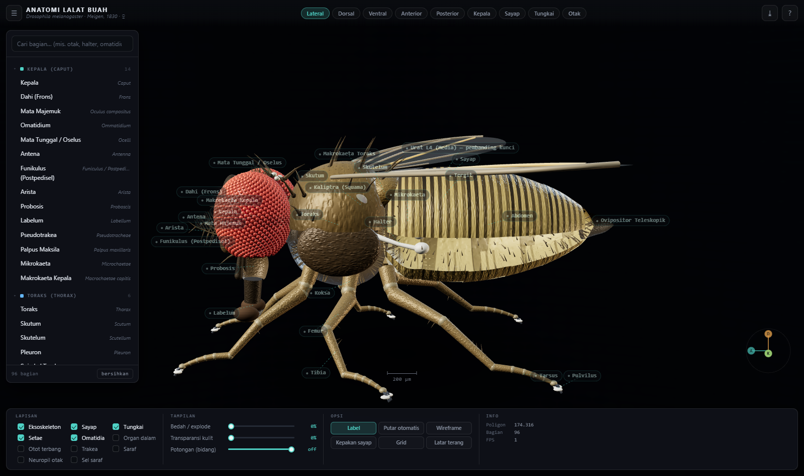
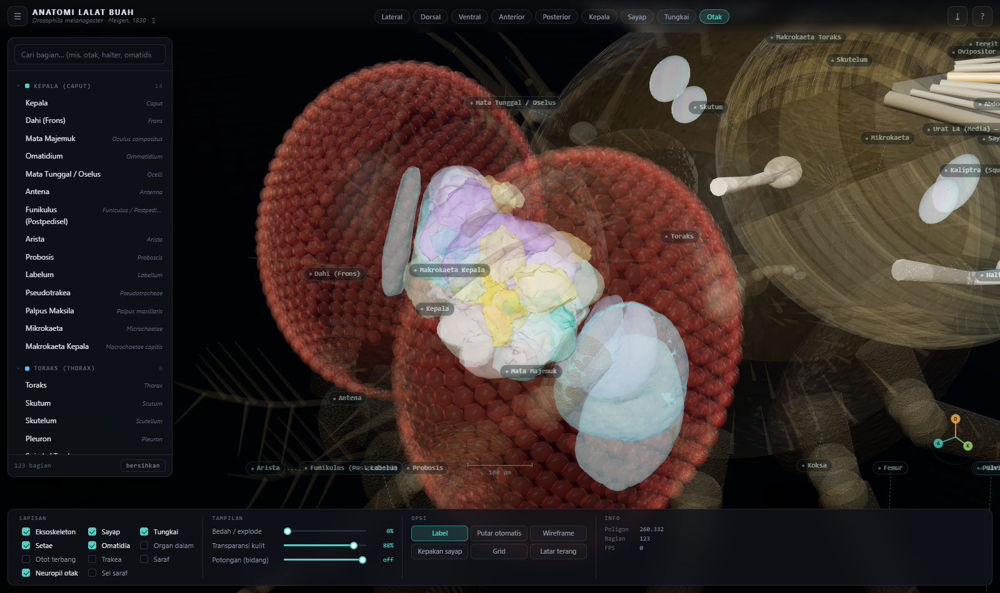

# Anatomi Lalat Buah 3D — *Drosophila melanogaster*

Penampil (viewer) 3D interaktif anatomi lalat buah di atas `<canvas>` WebGL,
dibangun sebagai fondasi untuk integrasi konektom otak **FlyWire**.

Seluruh geometri dibangun **prosedural** dengan Three.js — tidak ada satu pun
file aset eksternal (tanpa `.glb`, `.obj`, atau gambar tekstur). Semua tekstur
digambar saat runtime memakai Canvas 2D.

Model mengacu pada **betina**, sesuai asal konektom FlyWire.





---

## Menjalankan

```bash
node serve.js          # lalu buka http://localhost:5173
```

Bisa juga langsung membuka `index.html` dengan klik dua kali (semua skrip
bertipe klasik, bukan ES module), asal ada koneksi internet untuk mengambil
Three.js dari CDN. Satu-satunya yang tidak jalan lewat `file://` adalah
pemuatan mesh FlyWire asli — lapisan neuropil akan tetap tampil dalam mode
skematis.

---

## Struktur

| Berkas | Isi |
|---|---|
| `index.html` | Kerangka UI: bilah atas, sidebar, inspektur, bilah alat |
| `alive.html` | Halaman ringan terpisah: cuma bentuk lalat + otak otonom |
| `js/alive.js` | Bootstrap `alive.html` — tanpa sidebar/geometri neuron |
| `css/style.css` | Tema gelap, tata letak, komponen |
| `js/controls.js` | Orbit/pan/zoom sendiri (tanpa `examples/` dari CDN) |
| `js/textures.js` | Semua tekstur prosedural + peta lingkungan PBR |
| `js/anatomy-data.js` | **Basis data morfologi** — 123 bagian, nama Indonesia + Latin |
| `js/fly.js` | Konstruktor geometri 3D lengkap |
| `js/connectome.js` | Lapisan neuropil otak (skematis / mesh FlyWire) |
| `js/neurons.js` | Lapisan bentuk sel saraf (skematis / skeleton FlyWire) |
| `js/signal.js` | Animasi pulsa sinyal di sepanjang koneksi neuron terpilih |
| `js/brain-sim.js` | Simulasi otak otonom (leaky-integrator) → gerak tubuh |
| `js/app.js` | Scene, pencahayaan, interaksi, label, UI |
| `tools/get_neuropil_meshes.py` | Unduh 78 mesh neuropil FlyWire (tanpa akun) |
| `tools/fetch_flywire.py` | Konversi mesh neuropil → `data/neuropil.json` |
| `tools/fetch_flywire_skeletons.py` | Skeleton dari arsip Zenodo → `data/neurons.json` |
| `tools/fetch_neurons.py` | Konversi berkas SWC → `data/neurons.json` |
| `tools/fetch_connections.py` | Tabel edge FlyWire (852 MB) → `data/connections.json` |
| `tools/pipeline.sh` | Seluruh pipeline data, satu perintah (untuk server) |
| `docs/flywire.md` | Catatan teknis integrasi konektom |
| `docs/server.md` | **Menjalankan di server lain** |
| `Dockerfile` | Wadah siap pakai |
| `serve.js` | Server statis mini untuk pengembangan |

### Dua ruang koordinat

```
satuan sasis  ──(× SPEC.scale = 0.37)──>  milimeter dunia

+X = sisi kanan lalat      +Y = dorsal (punggung)      +Z = anterior (kepala)
```

Geometri di `fly.js` ditulis dalam satuan sasis agar proporsi mudah disetel;
seluruh root diskalakan sekali di akhir `build()`. Panjang tubuh ±2,5 mm,
rentang sayap ±5 mm, otak ±0,6 mm.

---

## Yang sudah dimodelkan (123 bagian)

**Kepala** — kapsul, dahi, mata majemuk, **±780 omatidia nyata sebagai
geometri** per mata, 3 oselus, antena aristat, arista bercabang panjang,
probosis lengkap, palpus maksila, mikrokaeta, makrokaeta bernama
(oselar, postvertikal, orbital, vibrisa).

**Toraks** — skutum, skutelum, pleuron, 2 pasang spirakel, makrokaeta toraks
bernama (humeral, presutural, notopleural, dorsosentral, supraalar, postalar,
skutelar), otot terbang DLM & DVM, otot kendali langsung.

**Sayap** — membran melengkung, venasi Drosophila lengkap (L1–L5, Sc, urat
anal, urat silang anterior & posterior), sel diskal, alula, kaliptra tereduksi
(Acalyptratae), halter pucat.

**Tungkai** — 6 tungkai penuh: koksa, trokanter, femur, tibia, tarsus 5
tarsomer, pretarsus, 2 cakar, 2 pulvilus, empodium, duri & seta.

**Abdomen** — badan, tergit dengan pita gelap melintang (pola betina),
sternit, 7 pasang spirakel, ovipositor teleskopik.

**Organ dalam** — esofagus, tembolok, proventrikulus, usus tengah, usus
belakang & rektum, 4 tubulus Malpighi, kelenjar ludah, ovarium, pembuluh
dorsal, badan lemak.

**Saraf** — otak dengan lobus optik, zona subesofageal, tali saraf ventral,
konektif serviks, serta **jaringan saraf tepi lengkap**: saraf antena, labial,
enam saraf tungkai, saraf sayap, saraf halter, saraf abdomen bersegmen, dan
sepasang serabut raksasa penggerak refleks lompat.

**Trakea** — batang longitudinal, cabang ke spirakel, kantung udara.

**Konektom** — **43 wilayah neuropil dari mesh FlyWire asli**: seluruh lobus
optik (lamina, medula, lobula, lobula plate, medula aksesori), jalur penciuman
(lobus antena, tanduk lateral), badan jamur (kaliks, pedunkulus, lobus medial &
vertikal), kompleks sentral (badan kipas, badan elipsoid, jembatan
protoserebral, noduli, bulb, gall, LAL), protoserebrum superior & ventrolateral,
lereng posterior, dan kelompok periesofageal.

**Bentuk sel saraf** — 7 berkas serabut: akson fotoreseptor (satu serabut per
faset, ditarik dari posisi omatidium sebenarnya), khiasma luar & dalam, neuron
proyeksi olfaktori, sel Kenyon, neuron kompas E-PG, neuron desenden.

---

## Pembeda dari lalat rumah

Model ini sebelumnya dibuat untuk *Musca domestica* lalu diarahkan ulang ke
*Drosophila melanogaster* agar sejalan dengan FlyWire. Ciri yang membedakan
keduanya dan sudah tercermin di model:

| | *Musca domestica* | *Drosophila melanogaster* |
|---|---|---|
| Panjang tubuh | ~7 mm | **~2,5 mm** |
| Omatidia/mata | ~4.000 | **~780** |
| Warna mata | merah kecoklatan | **merah terang** |
| Toraks | 4 garis hitam membujur | **polos cokelat kekuningan** |
| Abdomen | pita gelap **membujur** | **pita gelap melintang** |
| Urat media sayap | membelok tajam | **melengkung landai** |
| Arista | sisir rapat | **±6 cabang panjang** |
| Kaliptra | besar (Calyptratae) | **tereduksi (Acalyptratae)** |

---

## Fitur penampil

- Klik bagian mana pun → panel keterangan (nama Indonesia, nama Latin, ukuran, fungsi)
- **Klik satu neuron individual** (data FlyWire asli) → panel mitra pra/pascasinaps,
  disorot terpisah dari berkas serabutnya (`tools/fetch_connections.py`)
- **Animasi pulsa sinyal** di sepanjang koneksi ke mitra yang bergeometri —
  cyan = masuk, amber = keluar (`js/signal.js`; ilustratif, bukan simulasi biofisika)
- **Simulasi otak otonom** — aktivasi neuron dihitung sungguhan tiap frame
  (model laju/*leaky-integrator*) dan menggerakkan sayap, halter, **6 kaki
  (gaya jalan tripod)** & tubuh
  lalat sendiri, terus-menerus (`js/brain-sim.js`; toggle "Otak hidup" di
  bilah bawah; penyederhanaan besar — lihat `docs/flywire.md`). Juga jalan
  di halaman tersendiri yang jauh lebih ringan — lihat **["Lalat
  hidup"](#lalat-hidup-alivehtml)** di bawah.
- Daftar bagian terkelompok + pencarian
- **Bedah/explode** bertahap, **transparansi kulit (x-ray)**, **bidang potong**
- 11 lapisan yang bisa dinyalakan/dimatikan
- 9 sudut pandang preset (termasuk **Otak**) + fokus otomatis ke bagian terpilih
- Label melayang dengan garis penunjuk, isolasi bagian, wireframe
- Animasi kepakan sayap (diperlambat ke ±5 Hz; aslinya ±200 Hz)
- Batang skala, gizmo orientasi, ekspor PNG

### Pintasan papan tik

`1`–`9` sudut pandang · `L` label · `R` putar otomatis · `W` wireframe ·
`X` x-ray · `E` explode · `I` organ dalam · **`B` neuropil otak** ·
**`N` sel saraf** · `G` grid · `K` kepakan · **`O` otak hidup/berhenti** ·
`F` fokus · `P` simpan PNG · `Esc` reset · `Tab` sidebar

Dari konsol browser tersedia pegangan `APP` untuk pengembangan:
`APP.goView('otak')`, `APP.select('np-medula')`, `APP.model.parts.length`,
`APP.selectNeuron('720575940...')` (sorot satu neuron + tampilkan panel
konektivitasnya lewat root_id, tanpa perlu klik piksel yang pas).

---

## Lalat hidup (`alive.html`)

`index.html` untuk **eksplorasi anatomi** (x-ray, bedah, 125 bagian, klik
apa saja) dan `alive.html` untuk **menonton lalat "hidup"** (simulasi otak
otonom saja) sengaja dipisah jadi dua halaman — bukan satu halaman dengan
opsi tampil/sembunyi, supaya:

- **Jauh lebih ringan.** `alive.html` TIDAK PERNAH memuat `data/neurons.json`
  (79 MB, geometri 2,5 juta ruas garis lapisan "Sel saraf") maupun
  `js/connectome.js`/`js/neurons.js`/`js/signal.js` sama sekali — simulasi
  otak cuma butuh tahu neuron ini **termasuk bundel apa** (sensorik/motorik/
  dst.), bukan bentuk 3D-nya. Dipakai `data/neuron-bundle.json`, peta
  ringan root_id → id bundel (~75 KB, ditulis otomatis oleh
  `tools/fetch_flywire_skeletons.py` bersamaan dengan `neurons.json`).
  Total muatan halaman ini ±5 MB, dibanding puluhan MB di `index.html`
  begitu lapisan "Sel saraf" dinyalakan.
- **Cuma bentuk lalatnya.** Organ dalam, otot, saraf, trakea — semua
  bagian yang dibangun `FLY.build()` tapi bukan bagian luar tubuh —
  disembunyikan permanen (tak ada UI x-ray/lapisan di halaman ini). Yang
  tampil cuma eksoskeleton, sayap, tungkai, setae, mata: persis rupa lalat
  dari luar.
- **UI minimal**: cuma kamera orbit (berputar pelan sendiri), indikator
  aktivitas otak, dan tombol jeda/lanjut (`O`) — tak ada sidebar/inspektur/
  toolbar lapisan.

Otak & gerak tubuhnya (`js/brain-sim.js` + `js/alive.js`) identik dengan
yang ada di `index.html` — lihat bagian **Simulasi otak otonom** di atas
dan catatan penyederhanaan lengkap di `docs/flywire.md`.

---

## Konektom FlyWire

Dua lapisan otak, masing-masing punya dua mode:

| Lapisan | Mode bawaan | Mode data asli |
|---|---|---|
| **Neuropil otak** (`B`) | 15 wilayah skematis | **43 wilayah** mesh FlyWire asli |
| **Sel saraf** (`N`) | 7 berkas serabut skematis | skeleton dari `data/neurons.json` |

Mode skematis **bukan** geometri FlyWire — posisinya benar, bentuknya
disederhanakan. Begitu berkas data ada dan halaman disajikan lewat HTTP,
mode asli menggantikannya otomatis.

Mesh neuropil **tidak butuh akun FlyWire** — ikut dibundel dalam paket Python
`fafbseg`. Langkah lengkapnya (termasuk cuplikan ekstraksi) ada di
`docs/flywire.md`; ringkasnya:

```bash
pip download fafbseg --no-deps -d /tmp/fafb   # 7,9 MB, tanpa dependensi
# ekstrak fafbseg/data/JFRC2NP.surf.fw.zip -> folder berisi *.ply
pip install trimesh numpy
python tools/fetch_flywire.py --from-dir neuropil_ply
```

Untuk skeleton sel saraf (butuh unduhan SWC dari Codex, **urutan ini penting** —
skrip kedua membaca transformasi koordinat dari keluaran skrip pertama):

```bash
python tools/fetch_neurons.py --from-dir <folder skeleton swc>
```

Sumbu bawaan `x,-y,-z` sudah diverifikasi terhadap 11 syarat anatomi untuk
sumber mesh di atas.

Selengkapnya — sumber unduhan, transformasi koordinat, format data,
pemeriksaan orientasi, dan rencana tahap berikutnya — ada di
**[`docs/flywire.md`](docs/flywire.md)**.

> Data FlyWire non-komersial dan wajib disitasi. Tali saraf ventral tidak
> termasuk FlyWire (dataset MANC/FANC terpisah).

---

## Menjalankan di server lain

Proyek ini terbagi dua, dengan kebutuhan yang sangat berbeda:

| Bagian | Kebutuhan | Di mana |
|---|---|---|
| **Viewer** (`index.html`, `css/`, `js/`) | nyaris nol — berkas statis | mana saja |
| **Alat data** (`tools/`) | RAM lapang + unduhan besar | server |

Setelah datanya dibangun sekali, viewer hanya perlu berkas statis. Pola yang
dianjurkan: **rancang di laptop, bangun data di server, bawa pulang JSON-nya.**

```bash
git clone <repo-anda> && cd lalat
bash tools/pipeline.sh          # neuropil + skeleton, satu perintah
scp server:~/lalat/data/neurons.json data/    # bawa hasilnya pulang
```

Atau dengan Docker:

```bash
docker build -t anatomi-lalat .
docker run --rm -v "$PWD/data:/app/data" anatomi-lalat bash tools/pipeline.sh
docker run --rm -p 5173:5173 -v "$PWD/data:/app/data" anatomi-lalat
```

Kebutuhan RAM, ukuran unduhan, cara memilih jumlah neuron, dan catatan soal
jenis sel langka ada di **[`docs/server.md`](docs/server.md)**.

> **Peringatan dari pengalaman.** Mode streaming (tanpa `--local-file`) butuh
> RAM bebas ≥4 GB. Di mesin 8 GB dengan ~2 GB bebas, prosesnya dimatikan
> sistem dua kali. Di server, selalu unduh dulu lalu pakai `--local-file`.

---

## Menambah / mengubah bagian

1. Tambahkan entri di `js/anatomy-data.js`:

```js
'id-baru': {
  nama: 'Nama Indonesia', latin: 'Nomen latinum',
  grup: 'kepala',          // salah satu id di GROUPS
  layer: 'exo',            // exo|wing|leg|seta|eye|internal|muscle|nerve|trachea|connectome
  ukuran: ['...'],
  ringkas: 'Penjelasan singkat.',
  fakta: ['Poin menarik.']
}
```

2. Bangun geometrinya di `js/fly.js`, lalu daftarkan:

```js
g.add(reg(mesh, 'id-baru', {
  label: true,             // tampilkan label melayang
  explode: [0, 1.2, 0]     // arah gerak saat dibongkar
}));
```

Sidebar, pencarian, pemilihan, dan label akan terisi otomatis.

Fungsi pembantu di `fly.js`: `lathe()`, `link()`, `blob()`, `tube()`,
`joint()`, `bristle()`, `sampleSurface()`, `setaeMesh()`.

---

## Catatan akurasi

Proporsi tubuh, jumlah ruas, pola venasi sayap, pola makrokaeta, dan posisi
organ mengacu pada literatur morfologi Drosophilidae dan Diptera.

Penyederhanaan yang disengaja:
- Omatidia dimodelkan ±780/mata — mendekati angka literatur (750–800).
- Otot terbang digambarkan sebagai berkas, bukan serat individual.
- Usus digambarkan sebagai lintasan bersih; aslinya berkelok tak beraturan.
- Frekuensi kepakan animasi diperlambat ±40× agar bisa diamati.
- Wilayah neuropil dan bentuk sel saraf skematis **bukan** rekonstruksi
  FlyWire — jalurnya benar, bentuk tiap selnya disederhanakan.
- Jumlah serabut yang digambar lebih sedikit dari jumlah sebenarnya (kecuali
  akson fotoreseptor, yang digambar penuh 780 per mata).

Model ini untuk belajar & analisis morfologi, bukan untuk pengukuran
kuantitatif.

---

## Performa

±244.000 segitiga dan ±26.000 ruas garis bila semua lapisan menyala;
±620 objek gambar. Lancar pada GPU desktop mana pun.
Bila berat, matikan lapisan **Setae** dan **Omatidia** — keduanya menyumbang
porsi terbesar poligon.
